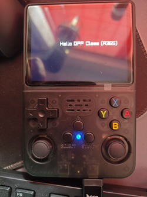
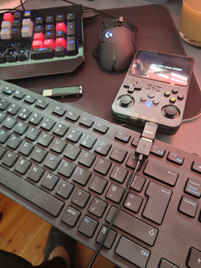
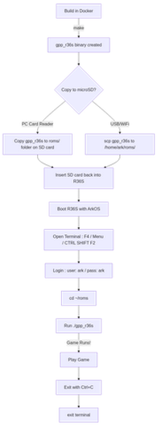
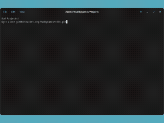
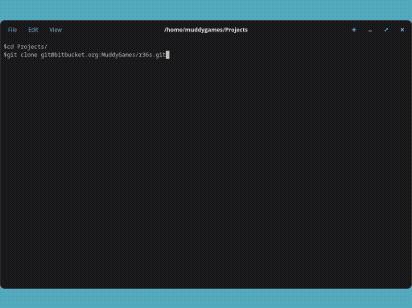
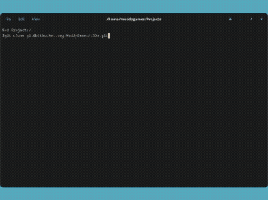

# R36S Development Environment

A [Docker-based](https://www.docker.com/) development environment for creating games targeting **R36S Retro Handheld Game Console** using [Raylib](https://www.raylib.com/).  



## Table of Contents <a name="r36s-starterkit-guide"></a>

- [Overview](#overview)
- [What is the R36S?](#what-is-the-r36s)
- [Features](#features)
- [Prerequisites](#prerequisites)
- [Quick Start](#quick-start)
- [Installation](#installation)
    - [Windows 10/11](./docs/windows.md#windows-1011-installation)
    - [Linux (Ubuntu/Debian)](./docs/linux.md#ubuntudebian)
    - [Linux (Fedora/CentOS/Rocky/RHEL)](./docs/linux.md#fedoracentosrockyrhel)
    - [Linux (Arch)](./docs/linux.md#arch-linux)
- [Development Workflow](#development-workflow)
- [Building Game](#building-game)
- [Testing and Debugging](./docs/debugging.md#testing-and-debugging)
- [Deploying to R36S](./docs/deploy.md#deploying-to-r36s)
- [Advanced Topics](./docs/advanced.md#advanced-topics)
    - [R36S Autostart Configuration](./docs/advanced.md#r36s-autostart-configuration)
    - [SSH Setup](./docs/advanced.md#ssh-setup)
    - [WiFi Configuration](./docs/advanced.md#wifi-configuration)
    - [Docker Compose](./docs/docker.md)
    - [GPU Passthrough](./docs/passthrough.md)
- [Hardware Setup](./docs/hardware.md#hardware-setup)
    - [Recommended SD Cards](./docs/hardware.md#recommended-sd-cards)
    - [ArkOS Installation](./docs/hardware.md#arkos-installation)
    - [Flashing ArkOS Image](./docs/hardware.md#flashing-arkos-image)
- [Troubleshooting](./docs/troubleshooting.md#troubleshooting)
    - [SD Card Issues](./docs/troubleshooting.md#fixing-sd-card-issues)
    - [Docker Issues](./docs/troubleshooting.md#docker-troubleshooting)
    - [Build Problems](./docs/troubleshooting.md#build-troubleshooting)
- [Reference](#reference)
    - [Useful Linux Commands](./docs/commands.md#useful-linux-commands)
    - [Recommended Accessories](./docs/r36s.md#useful-accessories)
- [FAQ](docs/faq.md#faq)
- [Sample Game](#sample-game-included)
- [Where to Buy](./docs/r36s.md#where-to-buy-r36s)
- [Disclaimer](./docs/r36s.md#disclaimer)

## Overview <a name="overview"></a>

This repository provides a development toolchain for **R36S Retro Handheld Game Console** running ArkOS. Development environment uses [Docker](https://www.docker.com/) with [Debian Bullseye](https://www.debian.org/releases/bullseye/) to create a cross-compilation environment that's compatible with the R36S older [GLIBC](https://en.wikipedia.org/wiki/Glibc) version.  



## What is an R36S? <a name="what-is-the-r36s"></a>

**R36S** portable retro handheld featuring:

- **Display**: 640x480 pixel screen 3.5" LCD with resolution: 640x480
- **Architecture**: ARM-based processor Rockchip [RK3326](https://www.rockchip.fr/RK3326%20datasheet%20V1.2.pdf) with [ARM Mali-G31 MP2](https://www.arm.com/products/silicon-ip-multimedia/gpu/mali-g31) OpenGL ES 3.2, 1 GB DDR3
- **OS**: Runs [ArkOS](https://github.com/christianhaitian/arkos/wiki) (Linux)

[Version Change Log](./ChangeLog.md)

## _StarterKit_ for R36S

| Feature | Benefit |
|---------|---------|
| 🐳 **Dockerized Build** | Keeps host system clean all tooling installed in Docker Container enabling cross platforms builds with [Docker](./Dockerfile)|
| 🎮 **Multi-Platform** | Test via local [web server](./docs/build_process.md) prior to deploying |
| 📦 **Setup** | Everything needed to [start developing](./README.md#installation) |
| 🎮 **Sample Game** | [Example](./src/main.c) with working code |
| 📚 **Docs** | Step-by-step [docs](./docs/) |
| 🔧 **Makefile** | [Builds](./Makefile) for R36S, Linux, Web and Windows |
| 📦 **Iteration** | Code -> Build -> Test -> Deploy |
| 🛠️ **Toolchain** | Web, Linux, Windows, ARM cross-compilation |

## _StarterKit_ Features <a name="features"></a>

- 🐳 **Docker Container**: Debian-based cross-compilation environment
- 🎮 **R36S Target**: ARM cross-compilation for R36S (640x480 display)
-  **Raylib Integration** : Built with DRM/GLES2 support for hardware rendering
- 🛠️ **Cross-compilation**: ARM toolchain with proper GLIBC compatibility
- 🎯 **Multi-Platform Build**: Build for R36S, Linux desktop, Web (Emscripten) and Windows
- 📦 **Complete Workflow**: Development and deployment to R36S
- 🎮 **Sample Game**: Missile Defense GPP example optimised for R36S 640x480 screen

## Prerequisites <a name="prerequisites"></a>

### Required

- **Docker** installed on your development machine (Windows 10/11 or Linux (preferred))
- **Docker Compose** installed, with docker compose only make targets are required to build game. Compose handles configuration of Docker Container runtime.
- **8GB+ RAM** at least for Docker builds (even with the crazy ram prices at the moment)
- **10GB+ free disk space** for Docker images and build artifacts (you will be running an OS in Docker container)
- **R36S device** with ArkOS installed for testing (this StarterKit worked on some clone R36s)

### Recommended

- **microSD card** (64GB see [Recommended SD Cards](#recommended-sd-cards))
- **USB-C to USB adapter** for connecting peripherals, _ideally a **powered USB hub**_
- **USB keyboard** for terminal access on R36S (careful with USB C port, its easy to damage)
- **SD Card reader** for flashing ArkOS and transferring files

### Prior Knowledge

- Basic command-line/terminal usage (Linux)
- Basic understanding of Docker (helpful but not required)
- Basic C programming knowledge for game development

## Quick Start

**Fewest possible commands (for a step by step guide continue to [installation](#installation) section):**

```bash
# Clone repository
git clone https://bitbucket.org/MuddyGames/r36s.git r36s
cd r36s

# Default make builds for web (note Docker Compose must be installed)
make

# OR

make debug_r36s
make release_r36s

# Copy build/r36s_release/gpp_r36s to R36S
# Deployment can also be achived over SSH
# Run on device: ./gpp_r36s

# Help ?
make help

```

For detailed step-by-step instructions, continue to [installation](#installation) section.

## What to do next? <a name="whats-next"></a>

### New to Development?

- [ ] Follow [Installation Guide](#installation)
- [ ] Complete [First Build](./docs/building.md)
- [ ] Read [Development Workflow](#development-workflow)
- [ ] Explore [Sample Game](#sample-game-included)

### Ready to Develop?

- [ ] See [Building Game](#building-your-game)
- [ ] Review [Sample Game](#sample-game-included)
- [ ] Learn [Debugging Techniques](./docs/debugging.md)
- [ ] Understand [Deploying to R36S](./docs/deploy.md)

### Advanced?

- [ ] Configure [Autostart on R36S](./docs/advanced.md#r36s-autostart-configuration)
- [ ] Set up [WiFi and SSH](./docs/advanced.md#ssh-setup)
- [ ] Optimise [Build Process](./docs/building.md#optimization)

## Installation <a name="installation"></a>

- [Windows](./docs/windows.md)
- [Linux (Ubuntu/Debian)](./docs/linux.md#ubuntudebian)
- [Linux (Fedora/CentOS/Rocky/RHEL)](./docs/linux.md#fedoracentosrockyrhel)
- [Linux (Arch)](./docs/linux.md#arch-linux)

## Development Workflow <a name="development-workflow"></a>

[](https://mermaid.live/edit#pako:eNp1kl1PwjAUhv9Kc64Bx5hs7ELDGKiJmogmRjcu6naEhtEu_VBx8N8t2yRcaNOkfd_znJ6mPRVkIkcIYSlpuSJPUcqJHeNkmjNNJja2IN3uBYmSyLAiJ4yTWGRrlDbGNWUc5aJJiWpuUj2h0vvGmhys3YNh2Zoc7B2Jk2d8I5EUn-qY2FAzUxQtNE1uGTdfJEa11qL8D5slz4zn9qS_QcbpL3mVxFgWYku0IPPB8NEmfLAMWz6uL35d3ShlUF22d582biNmp-LqVFzXxV5Q7cj41LkXO3LTlj2bY4FU4QI6sEG5oSy3D14d8BT0CjeYQmi3Ob5TU-gUUr63KDVaPG55BqGWBjsghVmuIHynhbLKlDnVGDNqP27zi5SUvwpxlEt5qNRmI89RToThGsLzGoWwgi8I-4HTc7xB4A5cz-0Hvg1uIez6vcAP7DwfDTzPC1xv34Hv-nCnNxo6nu_3naFdXccbdQBtuwh51_RS3VL7HwegtrI)

[Workflow Diagram](./docs/workflow.md)

### Step-by-Step Process

1. **Edit Code**: Modify your game code in `main.c` or other source files
2. **Build**: Run `make debug_r36s | release_r36s` inside container
3. **Test Locally** Build Web version with `make debug_web | release_web` and test
4. **Transfer to R36S**: Copy `build/r36s_release/gpp_r36s` to R36s
5. **Test on Device**: Run `./gpp_r36s` on R36S

### Build Targets

Makefile supports multiple targets:

```bash
# Build for R36S
make debug_r36s
make release_r36s

# Build for Linux desktop
make debug_linux
make release_linux

# Build for Web (Emscripten/WebAssembly)
make debug_web
make release_web

# Build for Windows
make debug_windows
make release_windows

# Clean builds
make clean_all

# Help ?
make help

```

**Output Locations**:

- 🎮 R36S
    - Release: `build/r36s_release/gpp_r36s`
    - Debug: `build/r36s_debug/gpp_r36s`
- 🐧 Linux
    - Release: `build/linux_release/gpp_linux`
    - Debug: `build/linux_debug/gpp_linux`
- 🕸️ Web
    - Release: `build/web_release/gpp_web.html`
    - Debug: `build/web_debug/gpp_web.html`
- 🪟 Windows
    - Release: `build/windows_release/gpp_windows`
    - Debug: `build/windows_debug/gpp_windows`

### Development Tips

- **Docker**: Start Docker container and keep it running for faster builds, this is automatic from v0.2 with Docker Compose.
- **Test**: Test small changes on Linux, Web or Windows Build prior to deploying to R36S
- **Assets**: Keep game assets (images, sounds) in project root under `./assets`

## Building Game for R36S Process <a name="building-game"></a>

### Project Structure

```
r36s/
├── Makefile				# Build
├── Dockerfile				# Docker setup
├── docker-compose.yml      # Docker compose file (v0.2 and v0.3 use Docker Compose)
├── include/				# Include Headers
│   ├── input_manager.h     # Input manager
│   ├── command.h           # Commands
│   └── constants.h         # Constants such as default screen width and height      
├── src/					# Game src files
│   ├── input_manager.c     # Input manager
│   ├── command.c           # Button, Key or Trigger Command
│   └── main.c
├── config/
│   └── config.mk           # R36S Deployment setting
├── assets/					# Game assets, images, sounds etc
│   ├── textures/
│   └── sounds/
├── docs/					# Detailed Help Files
├── rules/					# Makefiles for specific targets
├── scripts/				# Configuration scripts
├── web/	    			# Web template and icon file
└── build/					# Build output
    ├── r36s_release/		# R36S binary
    ├── linux_release/		# Test game in docker container
    ├── web_release/		# Test Game locally in Browser
    └── windows_release/	# Test Game in docker container
```  

Makefile targets:

```bash
# Builds for R36S
make debug_r36s
make release_r36s
make release_on_r36s

# Builds for Linux
make debug_linux
make release_linux

# Builds for Web
make debug_web
make release_web

# Builds for Windows
make debug_windows
make release_windows

# Clean builds
make clean_all

# Help ?
make help

```  

[](./docs/build_process.md)  
[Build Workflow Diagram](./docs/build_process.md)




Build Workflow for Web:

```bash
# Clone Repo
git clone https://bitbucket.org/MuddyGames/r36s.git r36s

# cd into repo
cd r36s

# Builds use Docker Compose
# Docker compose must be installed

# Build for Web
make release_web

# Open Web browser @
# http://localhost:8080/gpp_web.html

# Help ?
make help

```  



Build Workflow for Linux Desktop:

```bash
# Ensure Docker and Docker Compose are installed
# Clone Repo
git clone https://bitbucket.org/MuddyGames/r36s.git r36s

# cd into repo
cd r36s

# Builds build Docker
# depricated now using Docker compose
# sudo docker build -t r36s-build .
# To rebuild
# sudo docker build --no-cache -t r36s-raylib .

# Run Docker: this version setups display environment
# depricated now using Docker compose
# xhost +local:docker
# sudo docker run -it --rm -v $(pwd):/gpp -e DISPLAY=$DISPLAY -v /tmp/.X11-unix:/tmp/.X11-unix --device /dev/dri r36s-build

# Build for Linux Desktop
make debug_linux
# OR
make release_linux

# Run games
./build/linux_release/gpp_linux
# OR
./build/linux_debug/gpp_linux

# Run game and profile with valgrind (must be Debug build)
valgrind ./build/linux_debug/gpp_linux

# Valgrind with suppression file
valgrind -s \
  --leak-check=full \
  --show-leak-kinds=definite \
  --track-origins=yes \
  --suppressions=./gpp.supp \
  ./build/linux_debug/gpp_linux

# Help ?
make help

```  



Build Workflow for R36S:

```bash
# Ensure Docker and Docker Compose are installed
# Clone Repo
git clone https://bitbucket.org/MuddyGames/r36s.git r36s

# cd into repo
cd r36s

# Build for R36S
make debug_r36s
make release_r36s

# Deploy to R36S
# [Deploy](./docs/deploy.md)

# Help ?
make help

```  

Build Workflow for Windows Desktop:

```bash
# Ensure Docker and Docker Compose are installed
# Clone Repo
git clone https://bitbucket.org/MuddyGames/r36s.git r36s

# cd into repo
cd r36s

# Builds build Docker
# depricated now using Docker compose
# sudo docker build -t r36s-build .
# To rebuild
# sudo docker build --no-cache -t r36s-raylib .

# Run Docker: this version setups display environment
# depricated now using Docker compose
# xhost +local:docker
# sudo docker run -it --rm -v $(pwd):/gpp -e DISPLAY=$DISPLAY -v /tmp/.X11-unix:/tmp/.X11-unix --device /dev/dri r36s-build

# Build for Windows Desktop
make debug_windows
# OR
make release_windows

# Run games
wine ./build/windows_release/gpp_windows.exe
# OR
wine ./build/windows_debug/gpp_windows.exe

# Help ?
make help

```  

## Reference <a name="reference"></a>

[Useful Linux and Docker Commands](./docs/commands.md)

### Sample Game <a name="sample-game-included"></a>

Repository includes **Missile Defense** sample which demonstrates Raylib basics, input handling, and a game loop:

- 👨‍💻**Source Code**: [`missiledefense.c`](./src/advanced/missiledefense.c)
- 🎮**Gameplay**: Missile defense mechanics for R36S controls, input handling (buttons, analog) and score tracking
- 🖥️**Resolution**: Designed for 640x480 display
- 🧠**Learn More**: [Missile Defense StarterKit Repository](https://bitbucket.org/MuddyGames/multifilebuildvsc/src/master/)  


## Useful Links

- [**Raylib**](https://www.raylib.com/)
- 🐧[**ArkOS**](https://github.com/christianhaitian/arkos/wiki) R36S operating system
- 🐳[**Docker**](https://www.docker.com/)
- 📥[**Installing ArkOS**](https://youtu.be/8Q3WOVaM9eQ?si=b8n1k0B6VHhT7ghL)
- 🎮[**Input Management in this Project**](./docs/input.md)⌨️

[Disclaimer Please Read](./docs/r36s.md#disclaimer)

[Back to top](#r36s-starterkit-guide)