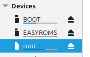
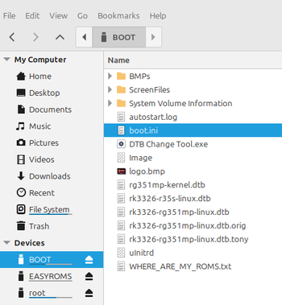
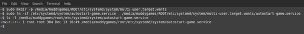
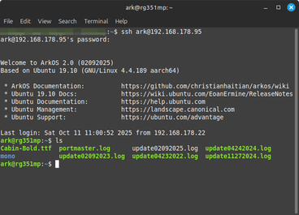
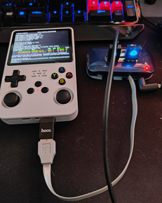

[Back to main README](../README.md)

## Advanced Topics <a name="advanced-topics"></a>

### R36S Autostart (Game Autostarts from SD Card) <a name="r36s-autostart-configuration"></a>

How to run **game binary automatically at boot** on **R36S**, **without** using:

- USB
- Keyboard
- Wi-Fi
- EmulationStation

All configuration is done **offline by editing the SD card on a PC**.

#### Scenario

- [X] USB port is broken (this happened to me after I dropped device)
- [X] Wi-Fi does not work (if USB port is broken then you cannot connect to Wifi or SSH)
- [X] Cannot use keyboard or SSH (again without Wifi you cannot SSH, if USB is broken then you cannot connect keyboard to get into TTY terminal)

#### Overview

1. Force ArkOS to boot into **text/console mode** (no EmulationStation)
2. Copy compiled **game binary** onto the ROOT filesystem
3. Create a startup shell script
4. Create a _systemd_ service to run the script
5. Enable the service **offline**
6. Disable EmulationStation **offline**
7. Use a log file on the BOOT partition for debugging

#### SD Card Layout

The ArkOSS SD card has three partitions:

- **BOOT** (FAT32, readable on Windows/macOS/Linux)
- **EASYROMS** (FAT32, readable on Windows/macOS/Linux)
- **ROOT** (ext4, Linux/WSL recommended)  


##### Step 1: Force boot into console mode

Edit _boot.ini_ file on **BOOT** partition:

```
[/media/your_host_name]/BOOT/boot.ini
```  


Edit `setenv bootargs` line by adding 'systemd.unit=multi-user.target':

```
# Original line (comment out)
#setenv bootargs "root=UUID='e139ce78-9841-40fe-8823-96a304a09859' rootwait rw fsck.repair=yes net.ifnames=0 fbcon=rotate:0 console=/dev/ttyFIQ0 quiet splash plymouth.ignore-serial-consoles consoleblank=0"

# New line (enables console mode)
setenv bootargs "root=UUID='e139ce78-9841-40fe-8823-96a304a09859' rootwait rw fsck.repair=yes net.ifnames=0 fbcon=rotate:0 console=/dev/ttyFIQ0 console=tty1 plymouth.ignore-serial-consoles consoleblank=0 systemd.unit=multi-user.target"
```
Copy line (comment out orgional) and add new line, this makes it easier to reverse changes and restore device to origional configuration

##### Step 2: Copy the game binary to ROOT

Create a directory:

```
#/home/ark/autostart/
sudo mkdir -p [/media/your_host_name]/ROOT/home/ark/autostart
```

Copy compiled game, assets and other dependacies:

```
#/home/ark/autostart/

e.g
sudo cp -avr ~/Projects/r36s/build/r36s_release/* [/media/your_host_name]/ROOT/home/ark/autostart

```

Make _gpp_r36s_ executable:

```
# game name for this project is gpp_r36s
chmod +x [/media/your_host_name]/ROOT/home/ark/autostart/gpp_r36s
```

##### Step 3: Create autostart script

Create in ArkOS SD _root_ partition:

```
touch [/media/your_host_name]/ROOT/usr/local/bin/autostart-game.sh
```

Shell Script:

```sh
#!/bin/sh

# Delay
sleep 2

# logging for debugging
LOG="/boot/autostart.log"

# Start Log
echo "gpp_r36s autostart $(date)" >> "$LOG"

# minimal environment
export HOME=/home/ark
export USER=ark
export SDL_VIDEODRIVER=kmsdrm
export SDL_AUDIODRIVER=alsa

# Run Game
cd /home/ark/autostart/ || exit 1
./gpp_r36s >> "$LOG" 2>&1

echo "gpp_r36s exited with code $?" >> "$LOG"
# End Log
```

Make _autostart-game.sh_ executable:

```
chmod +x [/media/your_host_name]/ROOT/usr/local/bin/autostart-game.sh
```

##### Step 4: Create _systemd_ service

_autostart-game.service_ File:

```
sudo touch [/media/your_host_name]/ROOT/etc/systemd/system/autostart-game.service
```

INI file contents:

```ini
[Unit]
Description=Autostart gpp_r36s game
After=multi-user.target

[Service]
Type=simple
WorkingDirectory=/home/ark/autostart/
ExecStart=/usr/local/bin/autostart-game.sh
Restart=no
StandardInput=tty
StandardOutput=tty
TTYPath=/dev/tty1

[Install]
WantedBy=multi-user.target
```

##### Step 5: Enable service

>NOTE: This command in within the terminal on the host machine. Your are modifying SD card and creating a Sybmolic Link

```
mkdir -p [/media/your_host_name]/ROOT/etc/systemd/system/multi-user.target.wants
ln -sf /etc/systemd/system/autostart-game.service   [/media/your_host_name]/ROOT/etc/systemd/system/multi-user.target.wants/autostart-game.service
```

##### Step 6: Disable EmulationStation

First make a backup copy the emulationstation, then delete the service

```
cp [/media/your_host_name]/ROOT/etc/systemd/system/multi-user.target.wants/emulationstation.service [/media/your_host_name]/ROOT/etc/systemd/system/multi-user.target.wants/emulationstation.copy.service

rm [/media/your_host_name]/ROOT/etc/systemd/system/multi-user.target.wants/emulationstation.service
```


>**NOTE**: This prevents EmulationStation from starting, allowing game to have full control.

##### Step 7: Boot from SD Card

- Insert SD card into R36S and power on.
- Game should launch automatically.

##### Debugging

Review Log:

```
[/media/your_host_name]/BOOT/autostart.log
```

Check that service is created

```bash
ls -l [/media/your_host_name]/ROOT/etc/systemd/system/multi-user.target.wants/autostart-game.service

# or find service

find [/media/your_host_name]/ROOT/ -name "autostart-game.service"

```

##### Recovery / Restore EmulationStation

Undo the autostart setup and restore the normal ArkOS + EmulationStation boot behaviour.

- Restore the service name `mv emulationstation.copy.service emulationstation.service`
- Disable the game autostart service `rm autostart-game.service`
- Remove setenv bootargs line edit `systemd.unit=multi-user.target` (remove comment and comment out line with `systemd.unit=multi-user.target`)

1. Mount BOOT partition
2. Edit `boot.ini` remove `systemd.unit=multi-user.target` from bootargs
3. Mount ROOT partition
4. Restore EmulationStation:
   ```bash
   sudo mv [/media/your_host_name]/ROOT/etc/systemd/system/emulationstation.copy.service [/media/your_host_name]/ROOT/etc/systemd/system/emulationstation.service
   ```
5. Remove autostart service:
   ```bash
   sudo rm [/media/your_host_name]/ROOT/etc/systemd/system/multi-user.target.wants/autostart-game.service
   ```

### SSH Setup <a name="ssh-setup"></a>

SSH enables remote terminal access to R36S over [WiFi](#wifi-configuration).

#### Enable SSH on R36S

**Start R36S and enter TTY Terminal** (USB keyboard or after first boot):

- Check SSH status and enable is not active

    ```bash
    # Check if SSH is running
    sudo systemctl status ssh
    ```

- Enable SSH is not active

    ```bash
    # If not active, enable and start it
    sudo systemctl enable ssh
    sudo systemctl start ssh

    # Verify SSH is running
    sudo systemctl status ssh
    ```

#### Connect to R36S from PC

**Login**:

- Username: `ark`
- Password: `ark` (normally or check R36S or ArkOS documentation)

- Connect to r36s via SSH (see Wifi Setup on how to obtain IP address)

    ```bash
    # From Linux/macOS/WSL Host
    ssh ark@192.168.x.x

    # Example
    ssh ark@192.168.178.95
    ```  
  

**Windows PuTTY**:

- [PuTTY](https://www.putty.org/)
- Enter IP address and port 22
- Username: `ark`

#### Useful SSH Commands

```bash
# Transfer files to R36S
scp gpp_r36s ark@192.168.x.x:/home/ark/autostart/

# Transfer files from R36S
scp ark@192.168.x.x:/home/ark/autostart/game.log ./

# Transfer directory recursively
scp -r build/r36s_release/ ark@192.168.x.x:/home/ark/autostart/

# Run command on R36S without logging in
ssh ark@192.168.x.x "cd /home/ark/autostart/ && ./gpp_r36s"
```

#### Security Recommendations

>**NOTE**:Because the password for SSH access to R36S is well known it is highly recommended to change default password. Also if Docker container is rebuilt then new keys are generated. These keys will need to be copied to Host and R36S. Ideally flash the OS on SD card, run setup sd card script, deploy new keys to device and host.

**Change default password**:

```bash
# On R36S via SSH
passwd
```  

**Use SSH keys** (see makefile and Docker file no password needed):

```bash
# On development machine
ssh-keygen -t ed25519

# Copy public key to R36S
ssh-copy-id ark@192.168.x.x

# SSH without password
ssh ark@192.168.x.x
```

### Copying SSH Keys from Docker Image to Host

```bash
docker compose exec gpp bash -lc 'cat /root/.ssh/id_r36s' > ~/.ssh/id_r36s
docker compose exec gpp bash -lc 'cat /root/.ssh/id_r36s.pub' > ~/.ssh/id_r36s.pub
```

Fix Permissions
```bash
chmod 600 ~/.ssh/id_r36s
chmod 644 ~/.ssh/id_r36s.pub
```

SSH from Terminal
```bash
ssh -i ~/.ssh/id_r36s ark@192.168.0.1 # Replace with IP Address of R36s
```

### R36 sshd_config modification to disable password login

TODO: Make this with SD Setup Script

```bash
sudo nano /etc/ssh/sshd_config

# Change lines as follows
PasswordAuthentication no
KbdInteractiveAuthentication no
ChallengeResponseAuthentication no
PubkeyAuthentication yes
UsePAM no
```
Restart SSH

```bash
sudo systemctl restart ssh || sudo systemctl restart sshd || sudo service ssh restart
```

Check that logging in with password fails

```bash
ssh -o PreferredAuthentications=password -o PubkeyAuthentication=no ark@192.168.0.61
```

### Additional Security Steps

1. Create a _non-interactive_ `dev` user 

```bash
sudo useradd \
  --system \
  --create-home \
  --home-dir /home/dev \
  --shell /usr/sbin/nologin \
  dev
```
`dev' User that cannot login.

2. Deny ark user access over SSH (careful this mean you must have local tty access)

- Edit /etc/ssh/sshd_config

```bash
sudo nano /etc/ssh/sshd_config

# Add line as follows
DenyUsers ark
```
Restart SSH

```bash
sudo systemctl restart ssh || sudo systemctl restart sshd || sudo service ssh restart
```

Change ark user password

```bash
sudo passwd ark

# Confirm new password

# Also consider locking ark user
sudo passwd -l ark
```
>**NOTE**:Recommend not deleting `ark` user as this may break system, also SSH

### WiFi Configuration <a name="wifi-configuration"></a>

Configure WiFi to enable SSH and network file transfers.

- Enable wifi (test system had `nmcli` installed)

    ```bash
    sudo nmcli radio wifi on
    ```

- List available wifi networks

    ```bash
    sudo nmcli dev wifi list
    ```

- Connect to wifi network

    ```bash
    sudo nmcli dev wifi connect "[Network_Name_SSID]" password "Password"

    # Verify connection
    sudo nmcli connection show

    # Restart connection
    sudo nmcli connection down "[Network_Name_SSID]"
    sudo nmcli connection up "[Network_Name_SSID]"
    ```

- IP Address

    ```bash
    hostname -I
    ```  
  

#### Save WiFi Configuration

Connection is automatically saved and will reconnect on future boots.

**View connections**:

```bash
nmcli connection show
```

**Forget network**:

```bash
nmcli connection delete "[Network_Name_SSID]"
```

### Troubleshooting WiFi

**WiFi not working**:

- Check if WiFi adapter is recognised: `lsusb` or `ip link`
- R36S needs USB WiFi dongle

**Cannot connect**:

- Check password is correct
- Use 2.4GHz network (not 5GHz)
- Check router is allowing new device connections

### Running VSC In Dev Container

1. Install Dev Containers extension in Visual Studio Code
2. Open the Project in Dev Container

    - Open project folder
    - Press Ctrl + Shift + P
    - Select: Dev Containers: Reopen in Container
    - To return to Host and Select: Dev Containers: Reopen folder locally

[Back to main README](../README.md)