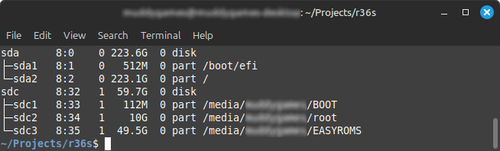
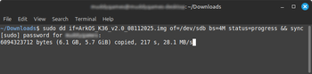

[Back to main README](../README.md)

## Hardware Setup <a name="hardware-setup"></a>

### Recommended SD Cards <a name="recommended-sd-cards"></a>

- Verified working card: 

- [Community listing of potentially compatible microSD cards](https://docs.google.com/spreadsheets/d/1gWxtr-GmwWop-_qGUq022RXxK2aTLpPg9Qra68TQLI8/edit?gid=0#gid=0)


**Verified Working**:

- [Samsung Evo Plus microSDXC 64GB](https://www.harveynorman.ie/cameras-drones/camera-accessories/memory-cards-and-readers/samsung-evo-plus-microsdxc-memory-card-64gb.html?gad_source=1&gad_campaignid=22616147750&gclid=Cj0KCQjwovPGBhDxARIsAFhgkwR-bWU7ciEAtGtoyfcxxBCI9u0O9QK3HT5pMUu1xraSCkOsQArsPIkaAq6DEALw_wcB)
- [Samsung Evo Plus microSDXC 64GB](https://www.samsung.com/us/computing/memory-storage/memory-cards/)

**Requirements**:

- Minimum: 32GB (64GB+ recommended)
- Speed: Class 10, UHS-I minimum
- Type: microSDXC or microSDHC
- [Community compatibility list](https://docs.google.com/spreadsheets/d/1gWxtr-GmwWop-_qGUq022RXxK2aTLpPg9Qra68TQLI8/edit?gid=0#gid=0)

**Tips**:

- Buy from trusted retailers
- Check reviews
- Format as FAT32 for ArkOS

### Ark OS Setup <a name="arkos-installation"></a>

- [ArkOS for R35S/R36S](https://github.com/AeolusUX/ArkOS-R3XS)
- [ArkOS for R35S/R36S Clones](https://github.com/AeolusUX/ArkOS-K36/releases)
- [ArkOS Wiki](https://github.com/christianhaitian/arkos/wiki)
- [Installation Guide for ArkOS v2.0](https://ko-fi.com/post/Installation-Guide-for-ArkOS-v2-0-01272024-J3J6TVPH1)

**Choose the right image**:

- Authentic R36S: Use R3XS image
- Clone: Use K36 image
- [Check Panel Type](https://aeolusux.github.io/ArkOS-R3XS/tools/dtbIdentify.htm)

### Flashing ArkOS Image onto SD Card <a name="flashing-arkos-image"></a>

- **WARNING**: Verify device name, using the wrong device (disk) will erase data on that device.

- Find SD card device:

	```bash
	# Before inserting card
    lsblk
    
    # Insert SD card and run again
    lsblk
	```  
    

    >*NOTE*: Look for the new device listing (usually `/dev/sdX` where X is partition / drive letter).

- Unmount (replace X with device letter):

	```bash
	sudo umount /dev/sdX*
	```

- Extract image e.g. filename `ArkOS_R35S-R36S_v2.0_07312025-1_MultiPanel.img.xz`:

	```bash
	unxz ArkOS_R35S-R36S_v2.0_07312025-1_MultiPanel.img.xz
	```

- Verify the extracted image:

	```bash
	ls -lh ArkOS_R35S-R36S_v2.0_07312025-1_MultiPanel.img
	file ArkOS_R35S-R36S_v2.0_07312025-1_MultiPanel.img
	```  

- **FINAL WARNING**: Verify device (disk) name, using the wrong device will erase data.

- Flash with dd ( replace sdX* with your card, e.g. /dev/sd_ ):

	```bash
	sudo dd if=ArkOS_R35S-R36S_v2.0_07312025-1_MultiPanel.img of=/dev/sdX bs=4M status=progress && sync
	```  
	  
	This is flashing on a Clone R36S (note image filename)

- Verify SD card:
	
	```bash
	sudo fdisk -l /dev/sdX
	```

- [Installation Guide for ArkOS v2.0](https://ko-fi.com/post/Installation-Guide-for-ArkOS-v2-0-01272024-J3J6TVPH1)

**What the flags mean**:

- `if=`: Input file (source image)
- `of=`: Output file (destination device)
- `bs=4M`: Block size (4MB chunks for speed)
- `status=progress`: Show progress bar
- `conv=fsync`: Ensure all data is written before completion

### Windows

**Option 1: Balena Etcher (Recommended)**

1. Download [Balena Etcher](https://www.balena.io/etcher/)
2. Install and run Etcher
3. Click _Flash from file_ select `.img.xz` file (no need to extract)
4. Click _Select target_; choose your SD card
5. Click _Flash_ and wait

**Option 2: Rufus**

1. Download [Rufus](https://rufus.ie/)
2. Extract the `.img.xz` file first using [7-Zip](https://www.7-zip.org/)
3. Run Rufus
4. Select your SD card from dropdown
5. Click _SELECT_ and choose the extracted `.img` file
6. Click _START_

#### macOS

Similar to Linux:

```bash
# Find disk
diskutil list

# Unmount (replace diskN with your disk)
diskutil unmountDisk /dev/diskN

# Flash
sudo dd if=ArkOS_R35S-R36S_v2.0_07312025-1_MultiPanel.img of=/dev/rdiskN bs=4m

# Note: Use /dev/rdiskN for faster writes
```

[Back to main README](../README.md)