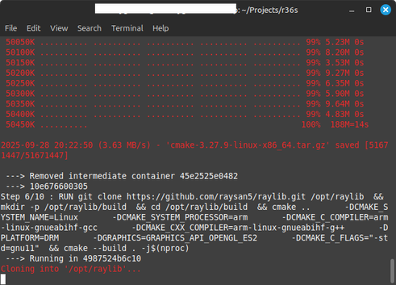
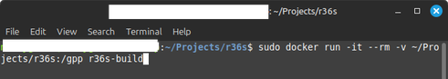
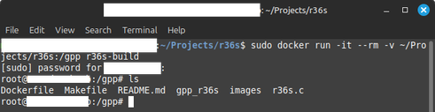
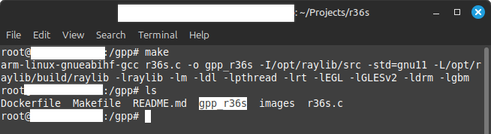
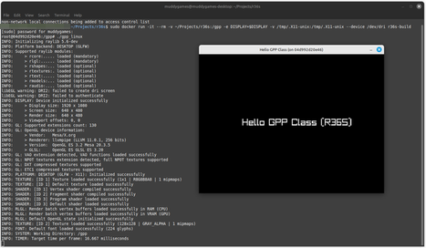

[Back to main README](../README.md)

## **Linux Installation**

### **Ubuntu/Debian** <a name="ubuntudebian"></a>

### 1. Update Package List

- Open Terminal
- Run the following command:

    ```bash
    sudo apt update
    ```

### 2. Install Docker 

- Run the following command:

    ```bash
    sudo apt install docker.io
    ```

Also install Docker Compose

See [Docker Compose](./docker.md)

### 3. Add User to Docker Group (optional, avoids need for sudo)

Enables running of Docker commands without `sudo`:

- Run the following commands:

    ```bash
    sudo usermod -aG docker $USER
    newgrp docker
    ```
>**Note**: Reboot or re-login maybe required for group changes to be applied.

### 4. Start and Enable Docker Service 

- Run the following commands:

    ```bash
    sudo systemctl start docker
    sudo systemctl enable docker
    ```

### 5. Verify Installation 

- Run the following command:

    ```bash
    docker --version
    ```
- You should see *Docker version* information

### 6. Clone Project 

- In Terminal run the following commands:

    ```bash
    git clone https://bitbucket.org/MuddyGames/r36s.git
    cd r36s
    ```

### 7. Build *Docker Container*

- In the same terminal, run the following command:

    ```bash
    sudo docker build -t r36s-build .
    ```  
    >**Note**: First build may take 5 to 10 minutes.  
    

### 8. Start *Docker Container* 

- Run the following command to start the container:

    ```bash

    # If just building for R36s or Linux
    sudo docker run -it --rm -v ~/Projects/r36s:/gpp r36s-build
    
    # If building and debugging for web (listen on port 8080)
    sudo docker run -it --rm -v ~/Projects/r36s:/gpp -p 8080:8080 r36s-build

    ```

- Docker Container run command:  


- Docker Container running:  


### 9. Build *R36s Binary*  

- Inside the *Docker container*, run the following command to build the *R36S binary* `gpp_r36s`:

    ```bash
    make PLATFORM=r36s
    ```  


    To run game with a visible game window X11 + GPU on Linux Desktop
    ```bash
    xhost +local:docker
    sudo docker run -it --rm -v ~/Projects/r36s:/gpp -e DISPLAY=$DISPLAY -v /tmp/.X11-unix:/tmp/.X11-unix --device /dev/dri r36s-build
    make PLATFORM=linux
    ./gpp_linux

    ```  
    

### **Fedora/CentOS/Rocky/RHEL** <a name="fedoracentosrockyrhel"></a>

### 1. Install Docker 

- Open Terminal
- Run the following command:

    ```bash
    sudo dnf install docker
    ```

- Or for older versions:

    ```bash
    sudo yum install docker
    ```

### 2. Start and Enable Docker Service 

- Run the following commands:

    ```bash
    sudo systemctl start docker
    sudo systemctl enable docker
    ```

### 3. Add User to Docker Group (optional, avoids need for sudo) 

- Run the following commands:

    ```bash
    sudo usermod -aG docker $USER
    newgrp docker
    ```

### 4. Verify Installation 

- Run the following command:

    ```bash
    docker --version
    ```

- You should see Docker version information

### 5. Clone Project 

- In Terminal run the following commands:

    ```bash
    git clone https://bitbucket.org/MuddyGames/r36s.git
    cd r36s
    ```

### 6. Build *Docker Container* 

- In the same terminal, run the following command:

    ```bash
    sudo docker build -t r36s-build .
    ```

### 7. *Start Docker* Container 

- Run the following command to start the container:

    ```bash
    # If just building for R36s or Linux
    sudo docker run -it --rm -v ~/Projects/r36s:/gpp r36s-build

    # If building and debugging for web (listen on port 8080)
    sudo docker run -it --rm -v ~/Projects/r36s:/gpp -p 8080:8080 r36s-build
    ```

### 8. Build *R36s Binary* 

- Inside the Docker container, run the following command to build the *R36S binary* `gpp_r36s`:

    ```bash
    make PLATFORM=r36s
    ```

### **Arch Linux** <a name="arch-linux"></a>

### 1. Install Docker 

- Open Terminal
- Run the following command:

    ```bash
    sudo pacman -S docker
    ```

### 2. Start and Enable Docker Service 

- Run the following commands:

    ```bash
    sudo systemctl start docker
    sudo systemctl enable docker
    ```

### 3. Add User to Docker Group (optional, avoids need for sudo) 

- Run the following commands:

    ```bash
    sudo usermod -aG docker $USER
    newgrp docker
    ```

### 4. Verify Installation 

- Run the following command:

    ```bash
    docker --version
    ```

- You should see *Docker version* information

### 5. Clone Project 

- In Terminal run the following commands:

    ```bash
    git clone https://bitbucket.org/MuddyGames/r36s.git
    cd r36s
    ```

### 6. Build *Docker Container*

- In the same terminal, run the following command:

    ```bash
    sudo docker build -t r36s-build .
    ```

### 7. *Start Docker* Container 

- Run the following command to start the container:

    ```bash
    # If just building for R36s or Linux
    sudo docker run -it --rm -v ~/Projects/r36s:/gpp r36s-build

    # If building and debugging for web (listen on port 8080)
    sudo docker run -it --rm -v ~/Projects/r36s:/gpp -p 8080:8080 r36s-build

    ```

### 8. Build *R36s Binary* 

- Inside the Docker container, run the following command to build the *R36S binary* `gpp_r36s`:

    ```bash
    make PLATFORM=r36s
    ```

[Back to main README](../README.md)