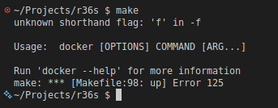

[Back to main README](../README.md)

### Fixing SD Card Issues <a name="fixing-sd-card-issues"></a>

- Wipe SD card:

	```bash
	sudo wipefs -a /dev/sdX*
	```

- Create fresh partition table::

	```bash
	sudo fdisk /dev/sdX*
	```

- Unmount (replace X with device letter):

	```bash
	sudo umount /dev/sdX*

	Press o (new DOS table)
	Press w (write + exit)
	```

- Use GParted (GUI):

	```bash
	sudo apt install gparted
	sudo gparted
	```

- Check for bad sectors:

	```bash
	sudo badblocks -v /dev/sdX*
	```  
	If bad blocks are found, the card is probably failing replace it (card that came with device did not like being written to more than a couple of times)

#### Common SD Card Issues

**Card not detected**:

- Try different card reader
- Check USB port works
- Try another computer
- Sometimes restarting computer release any locked resources (last resort)

**Write-protected**:

- Check physical lock switch on SD card adapter
- Some cards have internal write-protection flags

**Slow performance**:

- Use Class 10 or UHS-I cards
- Avoid cheap/generic brands
- Try different card reader

### Build Troubleshooting <a name="build-troubleshooting"></a>

#### Compilation Errors

**"Command not found: make"**:
```bash
# Check that you are inside Docker container
# Exit and restart container properly
docker run -it --rm -v $(pwd):/gpp r36s-build
```

**"raylib.h: No such file"**:
```bash
# Raylib not built properly
# Rebuild Docker image
docker build --no-cache -t r36s-build .
```

**GLIBC version errors on R36S**:

- Must build inside Docker container
- Verify Docker image is Debian Bullseye-based

#### Runtime Errors on R36S

**"Permission denied"**:
```bash
# Make executable
chmod +x gpp_r36s
```

**"cannot open shared object file"**:

- Missing library dependency
- Rebuild ensuring static linking or include shared libs
- Check Makefile flags

**Blank screen / no display**:
```bash
# Ensure environment variables are set
export SDL_VIDEODRIVER=kmsdrm
export SDL_AUDIODRIVER=alsa
./gpp_r36s
```

**Segmentation fault**:

- Check memory allocations
- Verify asset files are present
- Test on Linux build first with valgrind:
  ```bash
  make PLATFORM=linux
  valgrind --leak-check=full ./build/linux_release/gpp_linux
  ```

### Docker Troubleshooting <a name="docker-troubleshooting"></a>

#### Docker Build Fails

**"Cannot connect to Docker daemon"**:
```bash
# Check if Docker is running
sudo systemctl status docker

# Start if needed
sudo systemctl start docker

# On Windows: Ensure Docker Desktop is running
```

**"Permission denied" errors**:
```bash
# MAke sure your user is added to docker group (Linux)
sudo usermod -aG docker $USER
newgrp docker

# Or use sudo
sudo docker build -t r36s-build .
```

**Out of disk space**:
```bash
# Check Docker disk usage
docker system df

# Clean up unused images/containers
docker system prune -a

# Remove specific image
docker rmi r36s-build
```

#### Container Won't Start

**Port already in use**:
```bash
# Find what's using port 8080
sudo lsof -i :8080

# Kill the process or use different port
docker run -it --rm -v $(pwd):/gpp -p 8081:8080 r36s-build
```

**Volume mount issues (Windows)**:

- Ensure path uses forward slashes: `C:/Users/Name/Projects/r36s`
- Or use WSL paths: `/mnt/c/Users/Name/Projects/r36s`
- Check Docker Desktop | Settings | Resources | File Sharing

#### Make Error




Make Error Docker Compose not installed, install [Docker Compose](docker.md)

**Restart Docker**:
```bash
docker info
sudo systemctl start docker
sudo systemctl status docker
```


[Back to main README](../README.md)