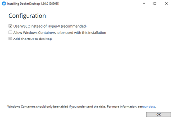
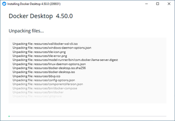
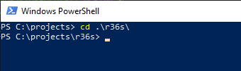
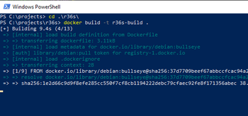
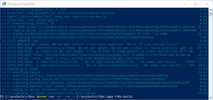
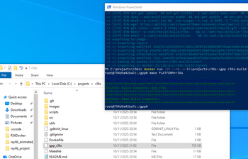
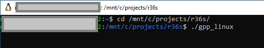
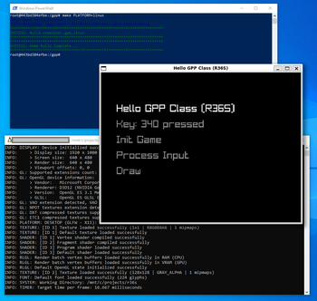

[Back to main README](../README.md)

## **Windows 10/11 Installation** <a name="windows-1011-installation"></a>

### WSL Ubuntu + Docker Engine + Docker Compose

For this project **most reliably toolchain on Windows**:

- **Windows 10 / 11 -> WSL2 Ubuntu -> Docker Engine -> Docker Compose**
- Docker Desktop has proven **to be more brittle** and harder to debug.


**Windows 10 / 11 → WSL2 Ubuntu → Docker Engine → Docker Compose**

Docker Desktop can work, but has proven **more brittle** and harder to debug.  
This README documents the **recommended, tested setup**.

>**NOTE:** Make sure that virtualisation is enabled within BIOS on PC you are running WSL virtual machine.

#### 1. Install WSL Ubuntu (PowerShell)

Powershell WSL Ubuntu Install

```powershell
# Run PowerShell as Administrator
wsl --install -d Ubuntu

# Run Ubuntu (via PowerShell reboot if requested)
wsl -d Ubuntu
```

# Check $USER (your user) can run systemd

sudo nano /etc/wsl.conf

# Check file contains (add if needed)

[boot]
systemd=true

# Go back to PowerShell
wsl --shutdown

# Reopen wsl Ubuntu
wsl -d Ubuntu

# Verify systemd
ps -p 1 -o comm=

# outputs `systemd`

```

#### WSL Configuration (Install Docker Engine + Docker Compose)
```bash
# Upgrade System

sudo apt update
sudo apt upgrade

# Install Docker
sudo apt install docker.io

# Start docker service and enable
sudo systemctl start docker
sudo systemctl enable docker

# Install Docker Compose
sudo apt update
sudo apt install ca-certificates curl gnupg lsb-release
sudo install -m 0755 -d /etc/apt/keyrings
curl -fsSL https://download.docker.com/linux/ubuntu/gpg | sudo gpg --dearmor -o /etc/apt/keyrings/docker.gpg
sudo chmod a+r /etc/apt/keyrings/docker.gpg

echo \
  "deb [arch=$(dpkg --print-architecture) signed-by=/etc/apt/keyrings/docker.gpg] \
  https://download.docker.com/linux/ubuntu \
  noble stable" | sudo tee /etc/apt/sources.list.d/docker.list > /dev/null

sudo apt update
sudo apt install docker-ce docker-ce-cli containerd.io docker-compose-plugin

# Start Docker
sudo systemctl enable --now docker

# Check versions installed
docker version
docker compose version

# Usermod so that its sudo in docker group
# May require reboot or restart

sudo usermod -aG docker $USER
newgrp docker

```

#### Test Docker

```bash
docker ps
docker run --rm hello-world
```

#### Nvidia GPU Docker Toolkit Install

```bash
sudo apt-get update
sudo apt-get install -y nvidia-container-toolkit
sudo nvidia-ctk runtime configure --runtime=docker
sudo systemctl restart docker
docker run --rm --gpus all nvidia/cuda:12.3.2-base-ubuntu22.04 nvidia-smi
```

### Compose Overides

[](https://mermaid.live/edit#pako:eNp1jt1OwkAQRl9lM9wW6D-lGJLCKmmkaohiYuvFQpfS0G6boVWR8O4uRRtu3IvNzOw5384R1kXMwYVNVnyutwwr8kwjQeTxQq8sb1bYH3dMdTSb372SPkF2yNKVLB5LLmbzjqmN3km3OyaTMOB71uKXZ8kt62zHRMNdYicNPg3pwm9pmiJfV2TBRcwxFQnxxQbZvsJ6XdXIr-xpY9PwnqPgGaGL4P-QgAmWcLyyaWPfhrOnF0Ix_eDY2r6oZF6feAGV98PSp773a4ICCaYxuHIfrkDOMWfnFo7n1AiqLc95BK4sY4a7CCJxkk7JxFtR5H8aFnWyBXfDsr3s6jJmFacpS5Dl7RSb3adFLSpwNdtpQsA9whe4hm31nIGlDjXL0geGaSpwANd0etp5ajiaaQ8Hum2fFPhuvlUbXB7dNCxdHRra6QeKxJEw)

On Windows to pass through GPUs several of the following have worked

Check what GPU and if dri is found ()
```bash
uname -a
ls -l /dev/dri  echo "no /dev/dri"
ls -l /usr/lib/wsl/lib 2>/dev/null | head
command -v nvidia-smi && nvidia-smi 
 echo "no nvidia-smi"
docker version
```

Nvidia GPU (nvidia container toolkit required)

Tested with a 4050 Laptop Series

```yml
services:
  gpp:
    volumes:
      - /tmp/.X11-unix:/tmp/.X11-unix
    environment:
      - DISPLAY=${DISPLAY:-:0}
    gpus: all
```

AMD GPU (tested on 60## XT)

```yml
services:
  gpp:
    volumes:
      - /tmp/.X11-unix:/tmp/.X11-unix
      - ${HOME}/.Xauthority:/root/.Xauthority:ro
    environment:
      - DISPLAY=:0
      - XAUTHORITY=/root/.Xauthority
'''

Change Makefile to use Overide yml file


## Docker Desktop Install

### 1. Install Docker Desktop for Windows

- Download from: https://www.docker.com/products/docker-desktop/
- Run the installer and follow the setup wizard
- Restart your computer when prompted
- Launch Docker Desktop and complete the initial setup  
  


### 2. Enable WSL 2 (if not already enabled)

- Open PowerShell as Administrator
- Run the following command:

    ```cmd
    wsl --install
    ```

- Restart if prompted

### 3. Verify Docker Installation

- Open Command Prompt or PowerShell
- Run the following command:

    ```cmd
    docker --version
    ```

- You should see Docker version information

### 4. Clone Project

- In PowerShell terminal run the following commands:

    ```cmd
    cd C:\Users\[user_name]\Projects
    git clone https://bitbucket.org/MuddyGames/r36s.git
    cd r36s
    ```  


**Note**: Replace `[user_name]` with windows username. If Projects folder does not exits create one first:

```powershell
mkdir C:\Users\[user_name]\Projects
cd C:\Users\[user_name]\Projects
```

### 5. Build *Docker Container*

- In the same PowerShell terminal, run the following command::

    ```cmd
    docker build -t r36s-build .
    ```  


### 6. *Start Docker* Container

- Run the following command to start the container:

    ```cmd

    # If just building for R36s or Linux
    docker run -it --rm -v C:\Path\To\Project:/gpp r36s-build
    
    # If building and debugging for web (listen with webserver on port 8080)
    docker run -it --rm -v C:\Path\To\Project:/gpp -p 8080:8080 r36s-build

    ```  


- Replace `C:\Path\To\Project` with the actual path to the directory where you cloned this repository. For example, if you cloned the repo to `C:\Projects\r36s`, use that path instead. Example:

    ```cmd

    docker run -it --rm -v C:\Projects\r36s:/gpp r36s-build

    docker run -it --rm -v C:\Projects\r36s:/gpp -p 8080:8080 r36s-build

    ```
>NOTE:
- `-v` flag maps windows folder to `/gpp` within container
- `-it` flag for interactive terminal
- `--rm` flag automatically removes container on exit

### 7. Build *R36s Binary*

- Inside the Docker container (inside the *Docker Teminal* that launches in Step 6), run the following command to build the *R36S binary* `gpp_r36s`:

    ```cmd
    make PLATFORM=r36s
    ```  


- Run the game on device or via WSL, or create a Windows Project and port to r36s

    ```cmd
    cd /mnt/c/projects/r36s/
    ./gpp_linux
    ```  
  


[Back to main README](../README.md)